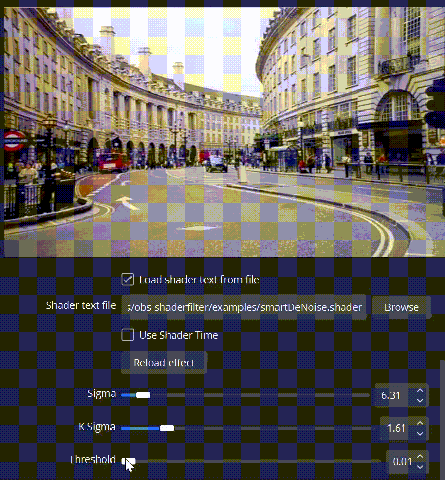

# smartDeNoise_OBS
Fast glsl deNoise spatial filter for OBS.
Michele Morrone authored the original shader, available at https://github.com/BrutPitt/glslSmartDeNoise. My contribution was adapting it for OBS Studio, so all credit goes to https://github.com/BrutPitt. 

For OBS integration, install the OBS Studio filter and save the .shader file on your PC. Add a User-Defined Shader to your source, select the .shader file, and adjust settings as required. Refer to the attached video for guidance.

OBS Studio is a free and open-source, cross-platform screencasting and streaming app. It is available for Windows, macOS, Linux distributions, and BSD.
https://obsproject.com/

OBS Studio filter is a plugin by Exeldro for applying an arbitrary shader to a video source.
https://github.com/exeldro/obs-shaderfilter

